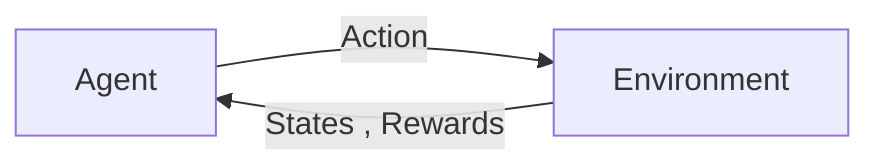

# Reinforcement Learning Autumn 2024 Lecture #2
https://www.youtube.com/watch?v=ToLxhUoM-oI
https://courses.cs.washington.edu/courses/cse579/24au/lectures/Lecture2_Intro_SL.pdf


### Lecture by Abhishek Gupta
### Ta: Jacob Berg

What is an MDP + why should we care?
- Markov Decision Process
- Utilized to generate labeled data
- It has some key parts:
    - States(s): the situation the Agent can be in
    - Actions(a): The choices the Agent can make
    - Transition Function(t): The probability of moving to a new state given the current state and action
    - Reward Function(r): The immediate reward recieved after taking an action
    - Policy (pi): A mapping from states to actions(what the agent learns)

In supervised imitation learning, the dataset is often generated by an expert acting in an MDP

### Back to the Lecture:

So an informal definition or reinforcement learning is:
- **Using Trial and error in an environment to learn a strategy to maximize some notion of a reward**



Easy way for agents to continue improving their own behavior on deployment


## Framework for RL - Markov Decision Process
Augment Markov Chain with rewards and actions

Need to look into this more:
- States (S) 
    - The different sitautions the agent can be in
- Actions (A)
    - All of the possible choices that the agent can make
- Rewards (R)
    - The score or feedback that the agent gets after an action
- Initial State Distribution
    - The probability of starting in each state(some states might be more likely to start in)
- Discount (V)
    - A number between 0 and 1 that says how much the agent values future rewards (closer to 1 = more patient)
- Transition Dynamics
    - The probability of ending up in state t+1 is if we are in state t and take action t


(look at images/markov decision process.png for a better visual)

### Markov Property
Your past is independent of your future conditional on your present

The future depends only on the present, not the past.

In other words:

Once you know the current state, you don’t need to know the whole history to predict what happens next.


### Trajectory 
Trajectory is the full sequence of what happens during one episode of interaction between the agent and its environment

so for example the expression

```τ = (s₀, a₀, r₀, s₁, a₁, r₁, ..., sₜ, aₜ, rₜ)```

means 

- The agent starts in state s₀
- Takes action a₀
- Receives reward r₀
- Lands in next state s₁
- Takes action a₁
- Gets reward r₁
- … and so on, until the final timestep T


The Goal of Reinforcement Learning is to the paramaters by policy by theta

Our policy by theta is gonna try and maximize the expectation over the sum of rewards in any trajectory

